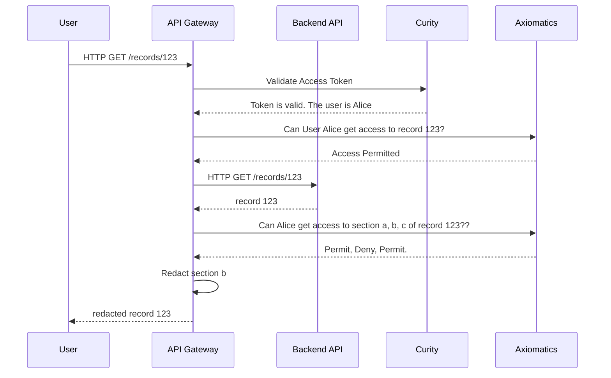

# Nordic APIs Demo
A repository containing all the artifacts necessary for the Nordic APIs demo

# Introduction

At The Nordic APIs Summit, Jonas Iggbom and David Brossard will secure an API live in front of the audience. We will start from scratch with a basic API (records) and add in an API gateway, OAuth AS, and ABAC Authorization Service.



# Running Instructions

````
docker compose pull
docker compose build
docker compose up
````

Note that docker compose build may have auth errors when pulling images. This will require you to manually docker pull those images and then rerun docker compose build.